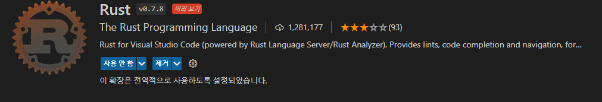

# 예비 개발자는 RUST의 꿈을 꾸지 않는다

모든 환경은 windows10에서 진행되었습니다. Linux혹은 MacOS 유저는 개발환경 구축 전까지는 다른 글을 참조해주시기 바랍니다

#### 00. 개발환경 구축 + 테스트

 https://www.rust-lang.org/en-US/install.html

위 사이트에서 인스톨러 받고 영어 잘 읽고 기다리면 된다.

vs code를 활용한 작업을 위해 아래 확장 프로그램을 설치하자.



바로 cargo를 활용한 프로젝트 생성으로 넘어가자

```
cargo new "파일명" --bin
```

으로 프로젝트를 생성하면 프로젝트 생성 끝이다. src/main.rs은 

```
fn main() {
    println!("Hello, world!");
}
```

기본적인 코드가 짜여져있다.

이제 빌드와 실행을 해보자

```
cargo build
cargo run
---------
cargo check
```

을 통해 빌드와 실행 둘다 된다. 

정상적인 환경이라면 Hello, world! 가 바로 뜬다. 

올바르게 컴파일이 되었는지만 확인하려면 빌드 이후 cargo check를 해주면 된다.

가끔 

```
warning: crate `test_Cargo` should have a snake case name
```

와 같은 경고가 뜨는 경우를 봤는데

main.rs 에 \#![allow(non_snake_case)] 를 추가해주면 해결된다.

------

#### 01. 기본 문법-1 (변수 , 데이터 타입)

##### 변수:

let 

특징: 불변성 변수이기에 재할당이 불가능하다

let mut

let에서 가변성이 되는 변수 

const

상수 더 할말이 없다

shadowing이라는 방법이 있는데 

```
fn main() {
    let x = 5;
    let x = x + 1;
    let x = x * 2;
    println!("The value of x is: {}", x);
}
```

이런 코드다. 결과는 12가 나온다. let mut와의 차이점이라면 새롭게 정의하는 것이라는 점이다.

또한 let mut는 변수의 형식을 바꿀 수 없다. 무슨 말이냐면 let mut int로 선언한 a라는 함수에 string값을 넣을수 없다는 사실이다. ~~쓰고 보니 너무 당연한거 같기도하네~~

##### 데이터 타입: 

```
#![allow(non_snake_case)]
fn main() {
    // addition
    let sum = 5 + 10;
    println!("{}",sum);
    // subtraction
    let difference = 95.5 - 4.3;
    println!("{}",difference);
    // multiplication
    let product = 4 * 30;
    println!("{}",product);
    // division
    let quotient = 56.7 / 32.2;
    println!("{}",quotient);
    // remainder
    let remainder = 43 / 5;
    println!("{}",remainder);
}
```

이런 형태의 코드에서 결과는 다음과 같다

```
15
91.2
120
1.7608695652173911
8
```


튜플, 배열과 같은 복합 타일 역시 자세히 구현되어있다.

```
#![allow(non_snake_case)]
fn main() {
    let tup = (500, 6.4, 1);

    let (x, y, z) = tup;

    println!("The value of y is: {}", y);
}
```

```
fn main() {
    let a = [1, 2, 3, 4, 5];
    let index = 10;

    let element = a[index];

    println!("The value of element is: {}", element);
}
```

------

#### 02. 기본 문법-  2 (함수 , 제어문)

함수 선언은 fn으로 시작하며 함수 이름 뒤에 괄호 형태로 인자를 받는다. 

```
#![allow(non_snake_case)]

fn main() {
    println!("Hello, world!");

    another_function();
}

fn another_function() {
    println!("Another function.");
}
```

아래와 같이 사용 가능하다

```
fn main() {
    another_function(5);
}

fn another_function(x: i32) {
    println!("The value of x is: {}", x);
}
```

여러개의 인자 역시 가능하다 

c언어를 처음 배울때 많이 헷갈렸던 구문과 표현식은 다음과 같다

```
#![allow(non_snake_case)]

fn main() {
    let x = 5;

    let y = {
        let x = 3;
        x + 1
    };

    println!("The value of y is: {}", y);
}
```

실행결과는 4가 나온다.  유의해야할점은 표현식에서의 종결은 ;이 존재하지 않다는 점이다. 

값을 return하는 함수는 다음과 같이 작성한다 

```
#![allow(non_snake_case)]

fn main() {
    let x = plus_one(5);

    println!("The value of x is: {}", x);
}

fn plus_one(x: i32) -> i32 {
    x + 1
}
```

주석은 `//주석입니다` 로 작성가능하다

다음은 기본적인 조건문이다.

 c++ , 파이썬 문법과 적절히 섞은 느낌이 든다 

```
fn main() {
    let number = 6;

    if number % 4 == 0 {
        println!("number is divisible by 4");
    } else if number % 3 == 0 {
        println!("number is divisible by 3");
    } else if number % 2 == 0 {
        println!("number is divisible by 2");
    } else {
        println!("number is not divisible by 4, 3, or 2");
    }
}
```

러스트에서 가장 흥미로운 부분중 하나였던 let에서의 if문이다

```
fn main() {
    let condition = true;
    let number = if condition {
        5
    } else {
        6 //"six" 로 작성한다면 if와 else의 결과 값이 다르기에 오류가 난다 
    };

    println!("The value of number is: {}", number);
}
```

